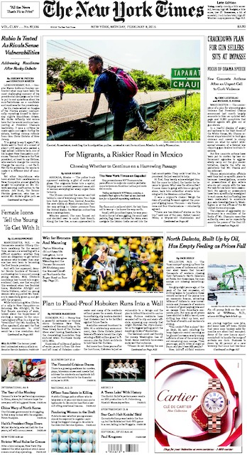

The New York Times Frontpage API
================================

A small library to retrieve cover pages of the New York Times as images. Turns
out the NYT hosts them and they're all just sitting there. Who would have
thought?

Usage
-----

Here's an example, runnable from the included ``demo.py`` file:

.. code-block:: python

  #!/usr/bin/env python
  # coding: utf-8
  import sys
  from datetime import date

  import nytfrontpage

  if __name__ == '__main__':
    today = date.today()
    print 'Fetching image contents...'
    image_contents = nytfrontpage.get_image_data(today)
    if image_contents:
      with open('frontpage.jpg', 'w') as f:
        f.write(image_contents)
      print 'Successfully downloaded the frontpage.'
    else:
      print 'The frontpage image has not been posted yet.'

.. code-block:: shell

  $ ./demo.py
  $ open frontpage.jpg

